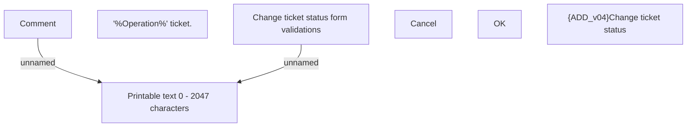

# Change ticket status - user interface

- **Diagram Type**: Custom
- **Package**: HomerSelect/BSL/Modules/Ticketing (TCK)/Analytical Model/User Interface Model/Change ticket status
- **Diagram ID**: 156204
- **Elements**: 7
- **Connectors**: 2

