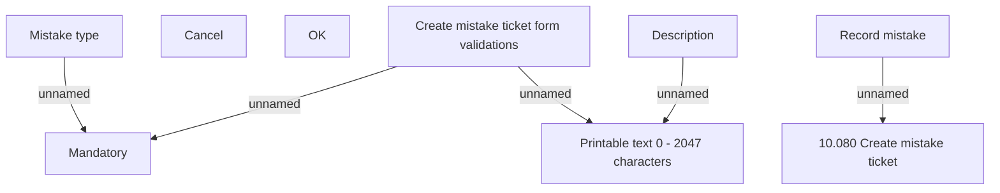

# Create mistake ticket - user interface

```mermaid
graph TD
    Create_mistake_ticket_form_validations["Create mistake ticket form validations"]
    Printable_text_0_2047_characters["Printable text 0 - 2047 characters"]
    Mandatory["Mandatory"]
    n_10_080_Create_mistake_ticket["10.080 Create mistake ticket"]
    Cancel["Cancel"]
    OK["OK"]
    Description["Description"]
    Mistake_type["Mistake type"]
    Record_mistake["Record mistake"]
    Record_mistake -->|unnamed| n_10_080_Create_mistake_ticket
    Mistake_type -->|unnamed| Mandatory
    Description -->|unnamed| Printable_text_0_2047_characters
    Create_mistake_ticket_form_validations -->|unnamed| Mandatory
    Create_mistake_ticket_form_validations -->|unnamed| Printable_text_0_2047_characters
```
