# Create ticket - user interface

- **Diagram Type**: Custom
- **Package**: HomerSelect/BSL/Modules/Ticketing (TCK)/Analytical Model/User Interface Model/Create ticket
- **Diagram ID**: 156206
- **Elements**: 14
- **Connectors**: 9

```mermaid
graph TD
    n_10_052_Revise_ticket_manually["10.052 Revise ticket manually"]
    ADD_Revised_ticket["{ADD}Revised ticket"]
    Type_Specification["Type Specification"]
    Printable_text_0_2047_characters["Printable text 0 - 2047 characters"]
    Create_ticket_form_validation["Create ticket form validation"]
    Mandatory["Mandatory"]
    n_10_020_Create_ticket_manually["10.020 Create ticket manually"]
    Assigned_to["Assigned to"]
    Type["Type"]
    Category["Category"]
    Cancel["Cancel"]
    OK["OK"]
    Description["Description"]
    Create_ticket["Create ticket"]
    Create_ticket -->|unnamed| n_10_020_Create_ticket_manually
    Assigned_to -->|unnamed| Mandatory
    Type -->|unnamed| Mandatory
    Category -->|unnamed| Mandatory
    Description -->|unnamed| Mandatory
    Description -->|unnamed| Printable_text_0_2047_characters
    Create_ticket -->|unnamed| n_10_052_Revise_ticket_manually
    Create_ticket_form_validation -->|unnamed| Mandatory
    Create_ticket_form_validation -->|unnamed| Printable_text_0_2047_characters
```

