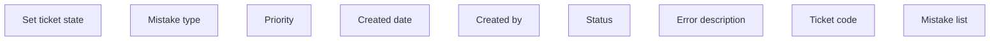

# Mistake list

- **Diagram Type**: Custom
- **Package**: HomerSelect/BSL/Modules/Ticketing (TCK)/Analytical Model/User Interface Model/Mistake list
- **Diagram ID**: 160840
- **Elements**: 9
- **Connectors**: 0

