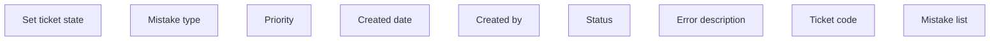

# Mistake list

```mermaid
graph TD
    Set_ticket_state["Set ticket state"]
    Mistake_type["Mistake type"]
    Priority["Priority"]
    Created_date["Created date"]
    Created_by["Created by"]
    Status["Status"]
    Error_description["Error description"]
    Ticket_code["Ticket code"]
    Mistake_list["Mistake list"]
```
