# {ADD}My overview form

- **Diagram Type**: Custom
- **Package**: HomerSelect/BSL/Modules/Ticketing (TCK)/Analytical Model/User Interface Model/My overview
- **Diagram ID**: 163240
- **Elements**: 23
- **Connectors**: 16

```mermaid
graph TD
    ADD_TCK_queue_list["{ADD}TCK queue list"]
    fromDate_toDate["fromDate - toDate"]
    My_changes_of_tickets["My changes of tickets"]
    ADD_My_changes_of_tickets["{ADD}My changes of tickets"]
    ADD_Assign_in_status["{ADD}Assign in status"]
    Show_Queue_detail["Show Queue detail"]
    n_10_062_Assign_ticket_to_user["10.062 Assign ticket to user"]
    Show_User_assignment_modal["Show User assignment modal"]
    n_10_100_Show_My_overview["10.100 Show My overview"]
    My_allocated_queues["My allocated queues"]
    My_assigned_active_tickets["My assigned active tickets"]
    n_10_017_Get_available_queues["10.017 Get available queues"]
    n_10_010_Search_for_tickets["10.010 Search for tickets"]
    n_10_063_Unassign_ticket_from_user["10.063 Unassign ticket from user"]
    n_10_030_Show_ticket_detail["10.030 Show ticket detail"]
    My_allocated_queues["My allocated queues"]
    n_["›"]
    int["‹int›"]
    n_["‹"]
    My_assigned_active_tickets["My assigned active tickets"]
    n_10_061_Assign_a_ticket_from_queue["10.061 Assign a ticket from queue"]
    MOD_Assign_new_ticket["{MOD}Assign new ticket"]
    My_Overview["My Overview"]
    int -->|unnamed| n_10_010_Search_for_tickets
    Show_User_assignment_modal -->|unnamed| n_10_062_Assign_ticket_to_user
    My_assigned_active_tickets -->|unnamed| Show_User_assignment_modal
    n_10_061_Assign_a_ticket_from_queue -->|unnamed| n_10_100_Show_My_overview
    n_10_030_Show_ticket_detail -->|unnamed| n_10_100_Show_My_overview
    My_allocated_queues -->|unnamed| n_10_017_Get_available_queues
    My_allocated_queues -->|unnamed| Show_Queue_detail
    n_ -->|unnamed| n_10_010_Search_for_tickets
    n_10_100_Show_My_overview -->|unnamed| My_Overview
    n_ -->|unnamed| n_10_010_Search_for_tickets
    My_assigned_active_tickets -->|unnamed| n_10_010_Search_for_tickets
    Show_User_assignment_modal -->|unnamed| n_10_063_Unassign_ticket_from_user
    My_assigned_active_tickets -->|unnamed| n_10_030_Show_ticket_detail
    My_allocated_queues -->|unnamed| n_10_061_Assign_a_ticket_from_queue
    MOD_Assign_new_ticket -->|unnamed| n_10_061_Assign_a_ticket_from_queue
    My_assigned_active_tickets -->|unnamed| n_10_010_Search_for_tickets
```

