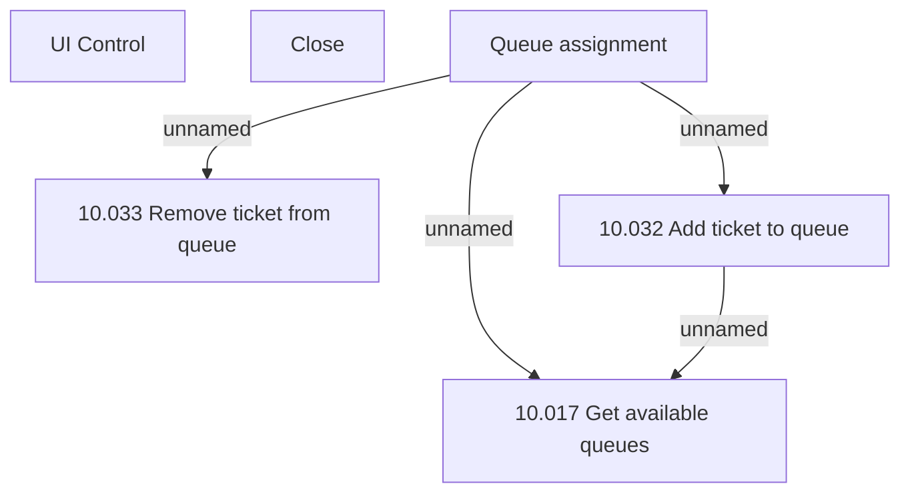

# {ADD}Queue assignment modal

- **Diagram Type**: Custom
- **Package**: HomerSelect/BSL/Modules/Ticketing (TCK)/Analytical Model/User Interface Model/Queue assignment modal
- **Diagram ID**: 156057
- **Elements**: 7
- **Connectors**: 4

