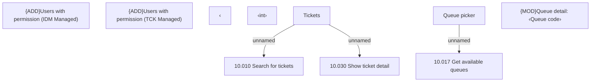

# {ADD}Queue detail screen

- **Diagram Type**: Custom
- **Package**: HomerSelect/BSL/Modules/Ticketing (TCK)/Analytical Model/User Interface Model/Queue detail
- **Diagram ID**: 156054
- **Elements**: 11
- **Connectors**: 3

