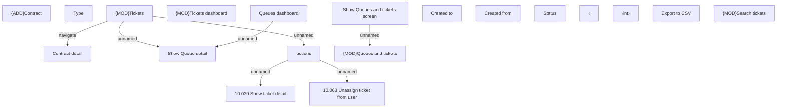

# Queues and tickets

```mermaid
graph TD
    ADD_Contract["{ADD}Contract"]
    Type["Type"]
    Contract_detail["Contract detail"]
    Show_Queue_detail["Show Queue detail"]
    n_10_063_Unassign_ticket_from_user["10.063 Unassign ticket from user"]
    n_10_030_Show_ticket_detail["10.030 Show ticket detail"]
    Show_Queues_and_tickets_screen["Show Queues and tickets screen"]
    MOD_Tickets_dashboard["{MOD}Tickets dashboard"]
    Queues_dashboard["Queues dashboard"]
    actions["actions"]
    MOD_Tickets["{MOD}Tickets"]
    Created_to["Created to"]
    Created_from["Created from"]
    Status["Status"]
    n_["›"]
    int["‹int›"]
    n_["‹"]
    Export_to_CSV["Export to CSV"]
    Queues_dashboard["Queues dashboard"]
    MOD_Search_tickets["{MOD}Search tickets"]
    MOD_Queues_and_tickets["{MOD}Queues and tickets"]
    Show_Queues_and_tickets_screen -->|unnamed| MOD_Queues_and_tickets
    MOD_Tickets -->|unnamed| actions
    actions -->|unnamed| n_10_030_Show_ticket_detail
    actions -->|unnamed| n_10_063_Unassign_ticket_from_user
    MOD_Tickets -->|unnamed| Show_Queue_detail
    Queues_dashboard -->|unnamed| Show_Queue_detail
    MOD_Tickets -->|navigate| Contract_detail
```
