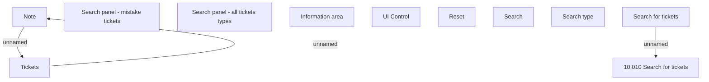

# Search for Tickets - user interface

- **Diagram Type**: Custom
- **Package**: HomerSelect/BSL/Modules/Ticketing (TCK)/Analytical Model/User Interface Model/Search for Tickets
- **Diagram ID**: 156207
- **Elements**: 11
- **Connectors**: 3

