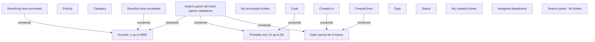

# Search panel - all tickets types

```mermaid
graph TD
    Date_cannot_be_in_future["Date cannot be in future"]
    Search_panel_all_ticket_types_validations["Search panel (all ticket types) validations"]
    Printable_text_10_up_to_60["Printable text 10 up to 60"]
    Number_1_up_to_9999["Number 1 up to 9999"]
    Priority["Priority"]
    Category["Category"]
    Created_to["Created to"]
    Created_from["Created from"]
    My_processed_tickets["My processed tickets"]
    Resolving_time_exceeded["Resolving time exceeded"]
    Reaction_time_exceeded["Reaction time exceeded"]
    Code["Code"]
    Type["Type"]
    Status["Status"]
    My_created_tickets["My created tickets"]
    Assigned_department["Assigned department"]
    Search_panel_All_tickets["Search panel - All tickets"]
    Search_panel_all_ticket_types_validations -->|unnamed| Number_1_up_to_9999
    Resolving_time_exceeded -->|unnamed| Number_1_up_to_9999
    Reaction_time_exceeded -->|unnamed| Number_1_up_to_9999
    Search_panel_all_ticket_types_validations -->|unnamed| Printable_text_10_up_to_60
    Code -->|unnamed| Printable_text_10_up_to_60
    Search_panel_all_ticket_types_validations -->|unnamed| Date_cannot_be_in_future
    Created_to -->|unnamed| Date_cannot_be_in_future
    Created_from -->|unnamed| Date_cannot_be_in_future
```
