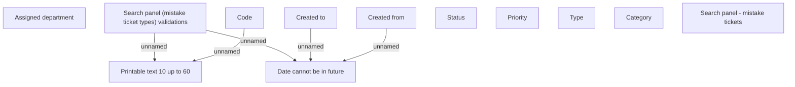

# Search panel - mistake tickets

```mermaid
graph TD
    Assigned_department["Assigned department"]
    Search_panel_mistake_ticket_types_validations["Search panel (mistake ticket types) validations"]
    Date_cannot_be_in_future["Date cannot be in future"]
    Printable_text_10_up_to_60["Printable text 10 up to 60"]
    Created_to["Created to"]
    Created_from["Created from"]
    Code["Code"]
    Status["Status"]
    Priority["Priority"]
    Type["Type"]
    Category["Category"]
    Search_panel_mistake_tickets["Search panel - mistake tickets"]
    Search_panel_mistake_ticket_types_validations -->|unnamed| Printable_text_10_up_to_60
    Code -->|unnamed| Printable_text_10_up_to_60
    Search_panel_mistake_ticket_types_validations -->|unnamed| Date_cannot_be_in_future
    Created_to -->|unnamed| Date_cannot_be_in_future
    Created_from -->|unnamed| Date_cannot_be_in_future
```
