# Ticket detail - user interface

- **Diagram Type**: Custom
- **Package**: HomerSelect/BSL/Modules/Ticketing (TCK)/Analytical Model/User Interface Model/Ticket detail
- **Diagram ID**: 156046
- **Elements**: 40
- **Connectors**: 16

```mermaid
graph TD
    Show_Queue_assignment_modal["Show Queue assignment modal"]
    Show_User_assignment_modal["Show User assignment modal"]
    el_1800569["Text"]
    el_1800570["Text"]
    el_1800568["Text"]
    n_10_033_Remove_ticket_from_queue["10.033 Remove ticket from queue"]
    n_10_032_Add_ticket_to_queue["10.032 Add ticket to queue"]
    n_10_063_Unassign_ticket_from_user["10.063 Unassign ticket from user"]
    n_10_062_Assign_ticket_to_user["10.062 Assign ticket to user"]
    ADD_Queues["{ADD}Queues"]
    n_10_052_Revise_ticket_manually["10.052 Revise ticket manually"]
    ADD_Revise_ticket["{ADD}Revise ticket"]
    n_10_051_Add_comment_to_ticket["10.051 Add comment to ticket"]
    Add_comment["Add comment"]
    n_10_071_Take_and_attach_photo_file_to_ticket["10.071 Take and attach photo file to ticket"]
    Take_and_attach_photo["Take and attach photo"]
    Type_specification["Type specification"]
    Search_for_Tickets_user_interface["Search for Tickets - user interface"]
    n_10_060_Change_ticket_status["10.060 Change ticket status"]
    n_10_070_Attach_a_file_to_ticket["10.070 Attach a file to ticket"]
    n_10_050_Assign_ticket_to_department["10.050 Assign ticket to department"]
    n_10_075_Download_a_ticket_attachment["10.075 Download a ticket attachment"]
    n_10_030_Show_ticket_detail["10.030 Show ticket detail"]
    Related_subjects["Related subjects"]
    Information_area["Information area"]
    Ticket_attachments["Ticket attachments"]
    Attach_file["Attach file"]
    Priority["Priority"]
    Set_ticket_state["Set ticket state"]
    MOD_Assign_department["{MOD}Assign department"]
    MOD_Department["{MOD}Department"]
    MOD_Subtype["{MOD}Subtype"]
    MOD_Type["{MOD}Type"]
    Description["Description"]
    Status["Status"]
    Code["Code"]
    Ticket_history["Ticket history"]
    ADD_Assignee["{ADD}Assignee"]
    Ticket_detail_panel["Ticket detail panel"]
    Ticket_detail["Ticket detail"]
    Take_and_attach_photo -->|unnamed| n_10_071_Take_and_attach_photo_file_to_ticket
    ADD_Assignee -->|unnamed| Show_User_assignment_modal
    ADD_Queues -->|unnamed| Show_Queue_assignment_modal
    Add_comment -->|unnamed| n_10_051_Add_comment_to_ticket
    Ticket_detail -->|unnamed| n_10_030_Show_ticket_detail
    Ticket_detail -->|unnamed| Search_for_Tickets_user_interface
    Set_ticket_state -->|unnamed| n_10_060_Change_ticket_status
    Attach_file -->|unnamed| n_10_070_Attach_a_file_to_ticket
    MOD_Assign_department -->|unnamed| n_10_050_Assign_ticket_to_department
    MOD_Department -->|unnamed| n_10_050_Assign_ticket_to_department
    Ticket_attachments -->|unnamed| n_10_075_Download_a_ticket_attachment
    ADD_Revise_ticket -->|unnamed| n_10_052_Revise_ticket_manually
    Show_User_assignment_modal -->|unnamed| n_10_063_Unassign_ticket_from_user
    Show_User_assignment_modal -->|unnamed| n_10_062_Assign_ticket_to_user
    Show_Queue_assignment_modal -->|unnamed| n_10_032_Add_ticket_to_queue
    Show_Queue_assignment_modal -->|unnamed| n_10_033_Remove_ticket_from_queue
```

