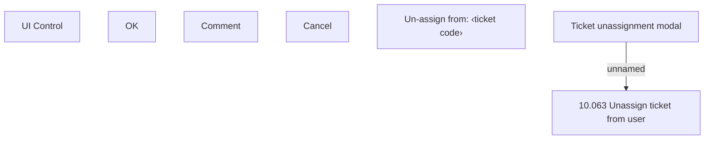

# {ADD}Ticket unassignment modal

- **Diagram Type**: Custom
- **Package**: HomerSelect/BSL/Modules/Ticketing (TCK)/Analytical Model/User Interface Model/Ticket unassignment modal
- **Diagram ID**: 156055
- **Elements**: 9
- **Connectors**: 1

