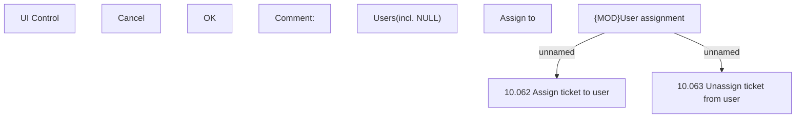

# {ADD}User assignment modal

```mermaid
graph TD
    UI_Control["UI Control"]
    n_10_063_Unassign_ticket_from_user["10.063 Unassign ticket from user"]
    n_10_062_Assign_ticket_to_user["10.062 Assign ticket to user"]
    Cancel["Cancel"]
    OK["OK"]
    Comment["Comment"]
    Comment["Comment:"]
    Users_incl_NULL["Users(incl. NULL)"]
    Assign_to["Assign to"]
    MOD_User_assignment["{MOD}User assignment"]
    MOD_User_assignment -->|unnamed| n_10_062_Assign_ticket_to_user
    MOD_User_assignment -->|unnamed| n_10_063_Unassign_ticket_from_user
```
