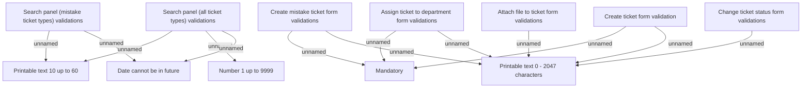

# Validation Rules

```mermaid
graph TD
    Date_cannot_be_in_future["Date cannot be in future"]
    Search_panel_mistake_ticket_types_validations["Search panel (mistake ticket types) validations"]
    Create_mistake_ticket_form_validations["Create mistake ticket form validations"]
    Attach_file_to_ticket_form_validations["Attach file to ticket form validations"]
    Assign_ticket_to_department_form_validations["Assign ticket to department form validations"]
    Change_ticket_status_form_validations["Change ticket status form validations"]
    Number_1_up_to_9999["Number 1 up to 9999"]
    Printable_text_0_2047_characters["Printable text 0 - 2047 characters"]
    Printable_text_10_up_to_60["Printable text 10 up to 60"]
    Search_panel_all_ticket_types_validations["Search panel (all ticket types) validations"]
    Mandatory["Mandatory"]
    Create_ticket_form_validation["Create ticket form validation"]
    Create_mistake_ticket_form_validations -->|unnamed| Mandatory
    Assign_ticket_to_department_form_validations -->|unnamed| Mandatory
    Create_ticket_form_validation -->|unnamed| Mandatory
    Search_panel_mistake_ticket_types_validations -->|unnamed| Printable_text_10_up_to_60
    Search_panel_all_ticket_types_validations -->|unnamed| Printable_text_10_up_to_60
    Create_mistake_ticket_form_validations -->|unnamed| Printable_text_0_2047_characters
    Attach_file_to_ticket_form_validations -->|unnamed| Printable_text_0_2047_characters
    Assign_ticket_to_department_form_validations -->|unnamed| Printable_text_0_2047_characters
    Change_ticket_status_form_validations -->|unnamed| Printable_text_0_2047_characters
    Create_ticket_form_validation -->|unnamed| Printable_text_0_2047_characters
    Search_panel_all_ticket_types_validations -->|unnamed| Number_1_up_to_9999
    Search_panel_mistake_ticket_types_validations -->|unnamed| Date_cannot_be_in_future
    Search_panel_all_ticket_types_validations -->|unnamed| Date_cannot_be_in_future
```
