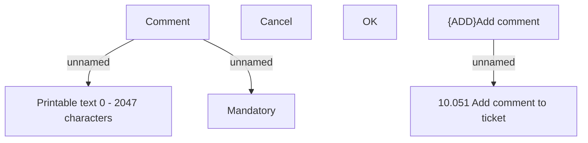

# {ADD}Add comment to ticket - user interface

- **Diagram Type**: Custom
- **Package**: HomerSelect/BSL/Modules/Ticketing (TCK)/Analytical Model/User Interface Model/{ADD}Add comment to ticket
- **Diagram ID**: 156200
- **Elements**: 7
- **Connectors**: 3

