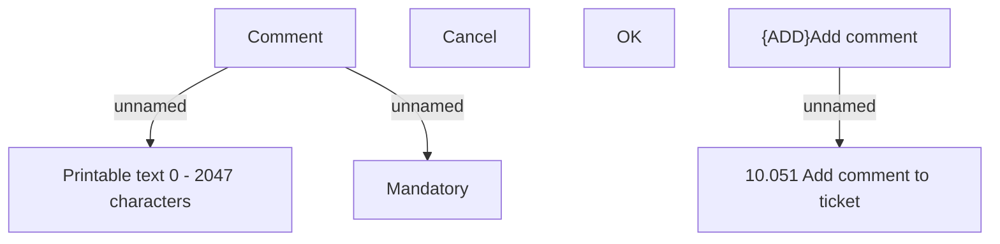

# {ADD}Add comment to ticket - user interface

```mermaid
graph TD
    n_10_051_Add_comment_to_ticket["10.051 Add comment to ticket"]
    Mandatory["Mandatory"]
    Printable_text_0_2047_characters["Printable text 0 - 2047 characters"]
    Comment["Comment"]
    Cancel["Cancel"]
    OK["OK"]
    ADD_Add_comment["{ADD}Add comment"]
    Comment -->|unnamed| Printable_text_0_2047_characters
    Comment -->|unnamed| Mandatory
    ADD_Add_comment -->|unnamed| n_10_051_Add_comment_to_ticket
```
