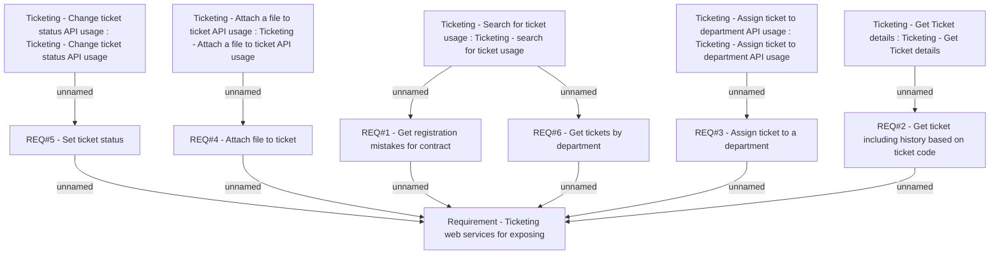

# CBL-1139 (CLM-866) IN Paperless REQ7 - Ticketing web services

```mermaid
graph TD
    REQ_6_Get_tickets_by_department["REQ#6 - Get tickets by department"]
    Ticketing_Change_ticket_status_API_usage_Ticketing_Change_ti["Ticketing - Change ticket status API usage : Ticketing - Change ticket status API usage"]
    REQ_5_Set_ticket_status["REQ#5 - Set ticket status"]
    Ticketing_Attach_a_file_to_ticket_API_usage_Ticketing_Attach["Ticketing - Attach a file to ticket API usage : Ticketing - Attach a file to ticket API usage"]
    REQ_4_Attach_file_to_ticket["REQ#4 - Attach file to ticket"]
    Ticketing_Assign_ticket_to_department_API_usage_Ticketing_As["Ticketing - Assign ticket to department API usage : Ticketing - Assign ticket to department API usage"]
    Ticketing_Get_Ticket_details_Ticketing_Get_Ticket_details["Ticketing - Get Ticket details : Ticketing - Get Ticket details"]
    REQ_3_Assign_ticket_to_a_department["REQ#3 - Assign ticket to a department"]
    REQ_2_Get_ticket_including_history_based_on_ticket_code["REQ#2 - Get ticket including history based on ticket code"]
    Ticketing_Search_for_ticket_usage_Ticketing_search_for_ticke["Ticketing - Search for ticket usage : Ticketing - search for ticket usage"]
    REQ_1_Get_registration_mistakes_for_contract["REQ#1 - Get registration mistakes for contract "]
    Requirement_Ticketing_web_services_for_exposing["Requirement - Ticketing web services for exposing"]
    REQ_6_Get_tickets_by_department -->|unnamed| Requirement_Ticketing_web_services_for_exposing
    REQ_5_Set_ticket_status -->|unnamed| Requirement_Ticketing_web_services_for_exposing
    REQ_4_Attach_file_to_ticket -->|unnamed| Requirement_Ticketing_web_services_for_exposing
    REQ_3_Assign_ticket_to_a_department -->|unnamed| Requirement_Ticketing_web_services_for_exposing
    REQ_2_Get_ticket_including_history_based_on_ticket_code -->|unnamed| Requirement_Ticketing_web_services_for_exposing
    REQ_1_Get_registration_mistakes_for_contract -->|unnamed| Requirement_Ticketing_web_services_for_exposing
    Ticketing_Search_for_ticket_usage_Ticketing_search_for_ticke -->|unnamed| REQ_1_Get_registration_mistakes_for_contract
    Ticketing_Get_Ticket_details_Ticketing_Get_Ticket_details -->|unnamed| REQ_2_Get_ticket_including_history_based_on_ticket_code
    Ticketing_Assign_ticket_to_department_API_usage_Ticketing_As -->|unnamed| REQ_3_Assign_ticket_to_a_department
    Ticketing_Attach_a_file_to_ticket_API_usage_Ticketing_Attach -->|unnamed| REQ_4_Attach_file_to_ticket
    Ticketing_Change_ticket_status_API_usage_Ticketing_Change_ti -->|unnamed| REQ_5_Set_ticket_status
    Ticketing_Search_for_ticket_usage_Ticketing_search_for_ticke -->|unnamed| REQ_6_Get_tickets_by_department
```
