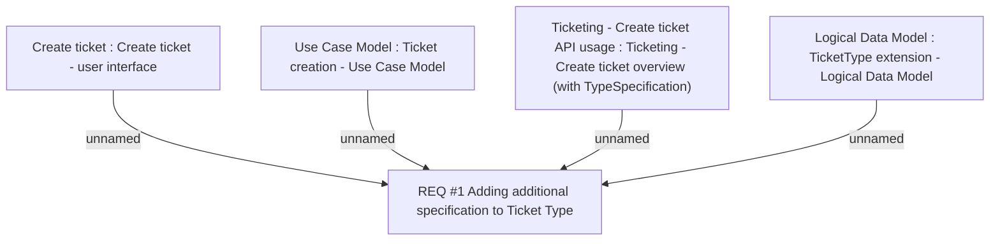

# CBL-1175 (CLM-749) PH TCK Extend ticket type with additional specification

- **Diagram Type**: Custom
- **Package**: HomerSelect/BSL/Modules/Ticketing (TCK)/Requirements/CBL-1175 (CLM-749) PH TCK Extend ticket type with additional specification
- **Diagram ID**: 156072
- **Elements**: 5
- **Connectors**: 4

