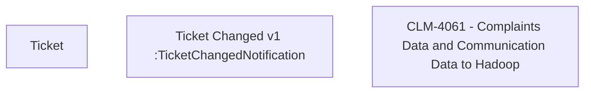

# CBL-11956 (CLM-4061) Complaints Data and Communication Data to Hadoop

- **Diagram Type**: Custom
- **Package**: HomerSelect/BSL/Modules/Ticketing (TCK)/Requirements/CBL-11956 (CLM-4061) Complaints Data and Communication Data to Hadoop
- **Diagram ID**: 156040
- **Elements**: 3
- **Connectors**: 0

