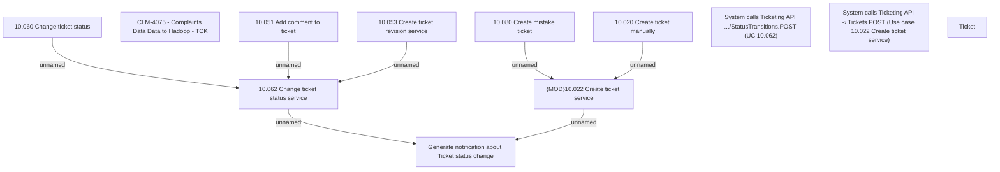

# CBL-11956 (CLM-4075) Complaints Data Data to Hadoop - TCK

```mermaid
graph TD
    n_10_080_Create_mistake_ticket["10.080 Create mistake ticket"]
    CLM_4075_Complaints_Data_Data_to_Hadoop_TCK["CLM-4075 - Complaints Data Data to Hadoop - TCK"]
    Generate_notification_about_Ticket_status_change["Generate notification about Ticket status change"]
    n_10_051_Add_comment_to_ticket["10.051 Add comment to ticket"]
    n_10_062_Change_ticket_status_service["10.062 Change ticket status service"]
    n_10_020_Create_ticket_manually["10.020 Create ticket manually"]
    n_10_060_Change_ticket_status["10.060 Change ticket status"]
    MOD_10_022_Create_ticket_service["{MOD}10.022 Create ticket service"]
    n_10_053_Create_ticket_revision_service["10.053 Create ticket revision service"]
    System_calls_Ticketing_API_StatusTransitions_POST_UC_10_062["System calls Ticketing API .../StatusTransitions.POST (UC 10.062)"]
    System_calls_Ticketing_API_Tickets_POST_Use_case_10_022_Crea["System calls Ticketing API -› Tickets.POST (Use case 10.022 Create ticket service) "]
    Ticket["Ticket"]
    n_10_062_Change_ticket_status_service -->|unnamed| Generate_notification_about_Ticket_status_change
    MOD_10_022_Create_ticket_service -->|unnamed| Generate_notification_about_Ticket_status_change
    n_10_060_Change_ticket_status -->|unnamed| n_10_062_Change_ticket_status_service
    n_10_080_Create_mistake_ticket -->|unnamed| MOD_10_022_Create_ticket_service
    n_10_051_Add_comment_to_ticket -->|unnamed| n_10_062_Change_ticket_status_service
    n_10_053_Create_ticket_revision_service -->|unnamed| n_10_062_Change_ticket_status_service
    n_10_020_Create_ticket_manually -->|unnamed| MOD_10_022_Create_ticket_service
```
