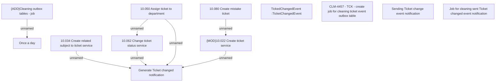

# CLM-4457 - TCK - create job for cleaning ticket event outbox table

```mermaid
graph TD
    ADD_Cleaning_outbox_tables_job["{ADD}Cleaning outbox tables - job"]
    Once_a_day["Once a day"]
    Generate_Ticket_changed_notification["Generate Ticket changed notification"]
    n_10_034_Create_related_subject_to_ticket_service["10.034 Create related subject to ticket service"]
    n_10_062_Change_ticket_status_service["10.062 Change ticket status service"]
    n_10_050_Assign_ticket_to_department["10.050 Assign ticket to department"]
    n_10_080_Create_mistake_ticket["10.080 Create mistake ticket"]
    MOD_10_022_Create_ticket_service["{MOD}10.022 Create ticket service"]
    TickedChangedEvent_TicketChangedEvent["TickedChangedEvent :TicketChangedEvent"]
    CLM_4457_TCK_create_job_for_cleaning_ticket_event_outbox_tab["CLM-4457 - TCK - create job for cleaning ticket event outbox table"]
    Sending_Ticket_change_event_notification["Sending Ticket change event notification"]
    Job_for_cleaning_sent_Ticket_changed_event_notification["Job for cleaning sent Ticket changed event notification"]
    n_10_050_Assign_ticket_to_department -->|unnamed| n_10_062_Change_ticket_status_service
    ADD_Cleaning_outbox_tables_job -->|unnamed| Once_a_day
    n_10_034_Create_related_subject_to_ticket_service -->|unnamed| Generate_Ticket_changed_notification
    n_10_080_Create_mistake_ticket -->|unnamed| MOD_10_022_Create_ticket_service
    n_10_062_Change_ticket_status_service -->|unnamed| Generate_Ticket_changed_notification
    MOD_10_022_Create_ticket_service -->|unnamed| Generate_Ticket_changed_notification
    n_10_050_Assign_ticket_to_department -->|unnamed| Generate_Ticket_changed_notification
```
