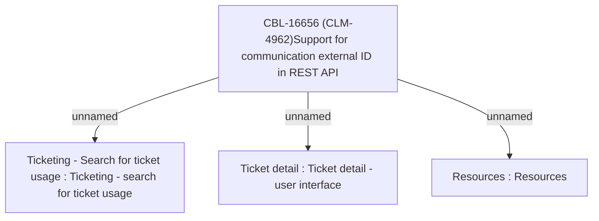

# CBL-16656 (CLM-4962)Support for communication external ID in REST API

- **Diagram Type**: Custom
- **Package**: HomerSelect/BSL/Modules/Ticketing (TCK)/Requirements/CBL-16656 (CLM-4962)Support for communication external ID in REST API
- **Diagram ID**: 156043
- **Elements**: 4
- **Connectors**: 3

