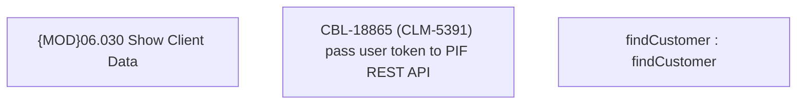

# CBL-18865 (CLM-5391) pass user token to PIF REST API

- **Diagram Type**: Custom
- **Package**: HomerSelect/BSL/Modules/Ticketing (TCK)/Requirements/CBL-18865 (CLM-5391) pass user token to PIF REST API
- **Diagram ID**: 156049
- **Elements**: 3
- **Connectors**: 0

