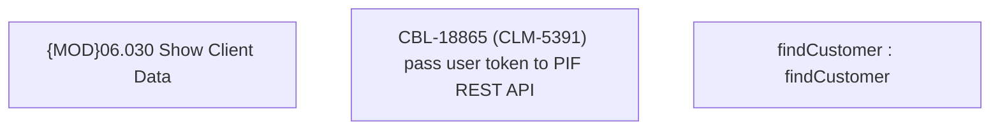

# CBL-18865 (CLM-5391) pass user token to PIF REST API

```mermaid
graph TD
    MOD_06_030_Show_Client_Data["{MOD}06.030 Show Client Data"]
    CBL_18865_CLM_5391_pass_user_token_to_PIF_REST_API["CBL-18865 (CLM-5391) pass user token to PIF REST API"]
    findCustomer_findCustomer["findCustomer : findCustomer"]
```
