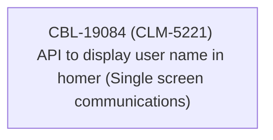

# CBL-19084 (CLM-5221) API to display user name in homer (Single screen communications)

- **Diagram Type**: Custom
- **Package**: HomerSelect/BSL/Modules/Ticketing (TCK)/Requirements/CBL-19084 (CLM-5221) API to display user name in homer (Single screen communications)
- **Diagram ID**: 156051
- **Elements**: 1
- **Connectors**: 0

