# CBL-19215 (CLM-5246) Add queue support - API 

- **Diagram Type**: Custom
- **Package**: HomerSelect/BSL/Modules/Ticketing (TCK)/Requirements/CBL-19215 (CLM-5246) Add queue support - API 
- **Diagram ID**: 156052
- **Elements**: 25
- **Connectors**: 8

```mermaid
graph TD
    addTicketToQueue_removeTicketFromQueue["addTicketToQueue :removeTicketFromQueue"]
    createTicket_createTicket["createTicket : createTicket"]
    getTicketQueues_getTicketQueues["getTicketQueues : getTicketQueues"]
    assignTicketToUser_assignTicketToUser["assignTicketToUser : assignTicketToUser"]
    assignTicketFromQueue_assignTicketFromQueue["assignTicketFromQueue : assignTicketFromQueue"]
    listQueues_listQueues["listQueues : listQueues"]
    Ticketing_API_MOD_Ticketing_API["Ticketing API :{MOD}Ticketing API"]
    Logical_Data_Model_Ticketing_Logical_Data_Model["Logical Data Model : Ticketing - Logical Data Model"]
    n_10_063_Unassign_ticket_from_user["10.063 Unassign ticket from user"]
    Use_Case_Model_Ticketing_assignments["Use Case Model : Ticketing - assignments"]
    n_10_062_Assign_ticket_to_user["10.062 Assign ticket to user"]
    n_10_061_Assign_a_ticket_from_queue["10.061 Assign a ticket from queue"]
    n_10_033_Remove_ticket_from_queue["10.033 Remove ticket from queue"]
    n_10_032_Add_ticket_to_queue["10.032 Add ticket to queue"]
    n_10_031_Get_ticket_queues["10.031 Get ticket queues"]
    n_10_017_Get_available_queues["10.017 Get available queues"]
    ADD_10_063_Unassign_ticket_from_user["{ADD}10.063 Unassign ticket from user"]
    ADD_10_062_Assign_ticket_to_user["{ADD}10.062 Assign ticket to user"]
    ADD_10_061_Assign_ticket_from_queue["{ADD}10.061 Assign ticket from queue"]
    ADD_10_033_Remove_ticket_from_queue["{ADD}10.033 Remove ticket from queue"]
    ADD_10_032_Add_ticket_to_queue["{ADD}10.032 Add ticket to queue"]
    ADD_10_031_Get_ticket_queues["{ADD}10.031 Get ticket queues"]
    ADD_10_017_Get_available_Queues["{ADD}10.017 Get available Queues"]
    clm5246DevsModsToOrigDraftOfDbStructuresExtensions["clm5246DevsModsToOrigDraftOfDbStructuresExtensions"]
    CBL_19215_CLM_5246_Add_queue_support_API["CBL-19215 (CLM-5246) Add queue support - API "]
    n_10_032_Add_ticket_to_queue -->|unnamed| n_10_017_Get_available_queues
    n_10_063_Unassign_ticket_from_user -->|unnamed| ADD_10_063_Unassign_ticket_from_user
    n_10_017_Get_available_queues -->|unnamed| ADD_10_017_Get_available_Queues
    n_10_061_Assign_a_ticket_from_queue -->|unnamed| ADD_10_061_Assign_ticket_from_queue
    n_10_031_Get_ticket_queues -->|unnamed| ADD_10_031_Get_ticket_queues
    n_10_032_Add_ticket_to_queue -->|unnamed| ADD_10_032_Add_ticket_to_queue
    n_10_062_Assign_ticket_to_user -->|unnamed| ADD_10_062_Assign_ticket_to_user
    n_10_033_Remove_ticket_from_queue -->|unnamed| ADD_10_033_Remove_ticket_from_queue
```

