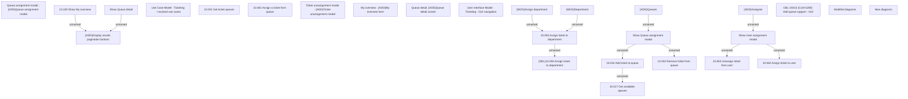

# CBL-19215 (CLM-5259) Add queue support - GUI

```mermaid
graph TD
    Queue_assignment_modal_ADD_Queue_assignment_modal["Queue assignment modal : {ADD}Queue assignment modal"]
    Show_Queue_detail["Show Queue detail"]
    ADD_Display_results_pagination_buttons["{ADD}Display results pagination buttons"]
    n_10_100_Show_My_overview["10.100 Show My overview"]
    Show_Queue_assignment_modal["Show Queue assignment modal"]
    Show_User_assignment_modal["Show User assignment modal"]
    Use_Case_Model_Ticketing_involved_use_cases["Use Case Model : Ticketing - involved use cases"]
    n_10_050_Assign_ticket_to_department["10.050 Assign ticket to department"]
    DEL_10_050_Assign_ticket_to_department["{DEL}10.050 Assign ticket to department"]
    n_10_063_Unassign_ticket_from_user["10.063 Unassign ticket from user"]
    n_10_033_Remove_ticket_from_queue["10.033 Remove ticket from queue"]
    n_10_032_Add_ticket_to_queue["10.032 Add ticket to queue"]
    n_10_031_Get_ticket_queues["10.031 Get ticket queues"]
    n_10_017_Get_available_queues["10.017 Get available queues"]
    n_10_062_Assign_ticket_to_user["10.062 Assign ticket to user"]
    n_10_061_Assign_a_ticket_from_queue["10.061 Assign a ticket from queue"]
    Ticket_unassignment_modal_ADD_Ticket_unassignment_modal["Ticket unassignment modal : {ADD}Ticket unassignment modal"]
    My_overview_ADD_My_overview_form["My overview : {ADD}My overview form"]
    Queue_detail_ADD_Queue_detail_screen["Queue detail :{ADD}Queue detail screen"]
    User_Interface_Model_Ticketing_GUI_navigation["User Interface Model : Ticketing - GUI navigation"]
    ADD_Queues["{ADD}Queues"]
    MOD_Department["{MOD}Department"]
    ADD_Assignee["{ADD}Assignee"]
    MOD_Assign_department["{MOD}Assign department"]
    CBL_19215_CLM_5259_Add_queue_support_GUI["CBL-19215 (CLM-5259) Add queue support - GUI"]
    Modified_diagrams["Modified diagrams"]
    New_diagrams["New diagrams"]
    n_10_100_Show_My_overview -->|unnamed| ADD_Display_results_pagination_buttons
    Show_Queue_detail -->|unnamed| ADD_Display_results_pagination_buttons
    MOD_Assign_department -->|unnamed| n_10_050_Assign_ticket_to_department
    ADD_Queues -->|unnamed| Show_Queue_assignment_modal
    MOD_Department -->|unnamed| n_10_050_Assign_ticket_to_department
    ADD_Assignee -->|unnamed| Show_User_assignment_modal
    Show_User_assignment_modal -->|unnamed| n_10_063_Unassign_ticket_from_user
    n_10_032_Add_ticket_to_queue -->|unnamed| n_10_017_Get_available_queues
    Show_User_assignment_modal -->|unnamed| n_10_062_Assign_ticket_to_user
    Show_Queue_assignment_modal -->|unnamed| n_10_032_Add_ticket_to_queue
    Show_Queue_assignment_modal -->|unnamed| n_10_033_Remove_ticket_from_queue
    n_10_050_Assign_ticket_to_department -->|unnamed| DEL_10_050_Assign_ticket_to_department
```
