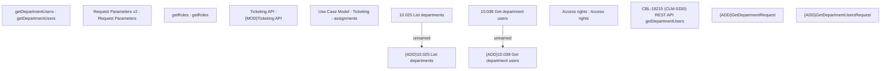

# CBL-19215 (CLM-5330) REST API getDepartmentUsers

```mermaid
graph TD
    getDepartmentUsers_getDepartmentUsers["getDepartmentUsers : getDepartmentUsers"]
    Request_Parameters_v2_Request_Parameters["Request Parameters v2 : Request Parameters"]
    getRoles_getRoles["getRoles : getRoles"]
    Ticketing_API_MOD_Ticketing_API["Ticketing API :{MOD}Ticketing API"]
    Use_Case_Model_Ticketing_assignments["Use Case Model : Ticketing - assignments"]
    ADD_10_038_Get_department_users["{ADD}10.038 Get department users"]
    ADD_10_025_List_departments["{ADD}10.025 List departments"]
    n_10_025_List_departments["10.025 List departments"]
    n_10_038_Get_department_users["10.038 Get department users"]
    Access_rights_Access_rights["Access rights : Access rights"]
    CBL_19215_CLM_5330_REST_API_getDepartmentUsers["CBL-19215 (CLM-5330) REST API getDepartmentUsers"]
    ADD_GetDepartmentRequest["{ADD}GetDepartmentRequest"]
    ADD_GetDepartmentUsersRequest["{ADD}GetDepartmentUsersRequest"]
    n_10_038_Get_department_users -->|unnamed| ADD_10_038_Get_department_users
    n_10_025_List_departments -->|unnamed| ADD_10_025_List_departments
```
