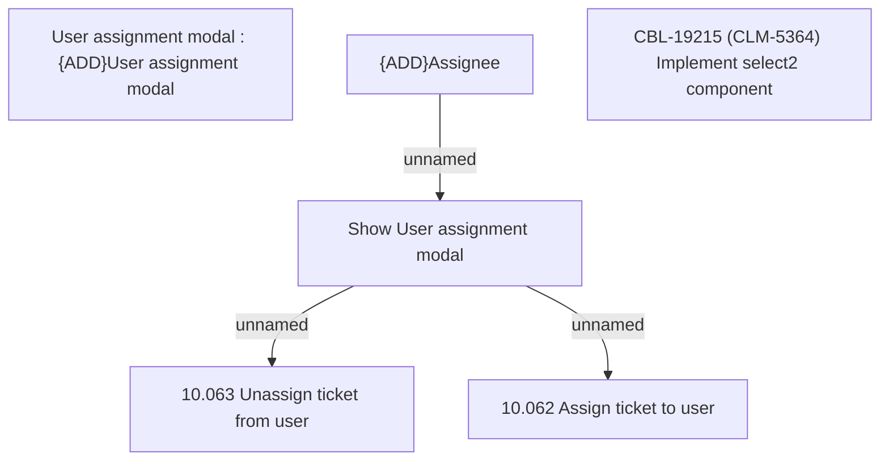

# CBL-19215 (CLM-5364) Implement select2 component

- **Diagram Type**: Custom
- **Package**: HomerSelect/BSL/Modules/Ticketing (TCK)/Requirements/CBL-19215 (CLM-5364) Implement select2 component
- **Diagram ID**: 156061
- **Elements**: 6
- **Connectors**: 3

