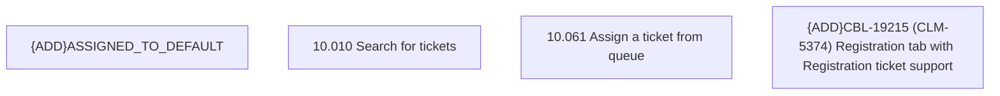

# CBL-19215 (CLM-5374) Registration tab with Registration ticket support

- **Diagram Type**: Custom
- **Package**: HomerSelect/BSL/Modules/Ticketing (TCK)/Requirements/CBL-19215 (CLM-5374) Registration tab with Registration ticket support
- **Diagram ID**: 156063
- **Elements**: 4
- **Connectors**: 0

