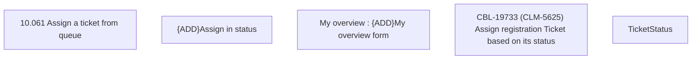

# CBL-19733 (CLM-5625) Assign registration ticket based on its status

- **Diagram Type**: Custom
- **Package**: HomerSelect/BSL/Modules/Ticketing (TCK)/Requirements/CBL-19733 (CLM-5625) Assign registration ticket based on its status
- **Diagram ID**: 156067
- **Elements**: 5
- **Connectors**: 0

