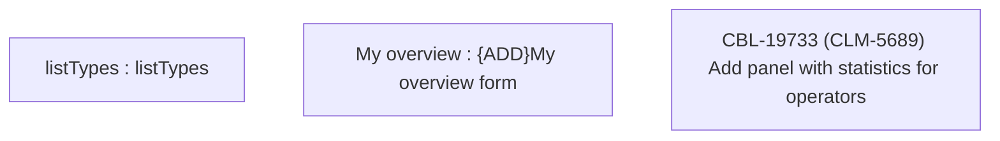

# CBL-19733 (CLM-5689) Add panel with statistics for operators

- **Diagram Type**: Custom
- **Package**: HomerSelect/BSL/Modules/Ticketing (TCK)/Requirements/CBL-19733 (CLM-5689) Add panel with statistics for operators
- **Diagram ID**: 156068
- **Elements**: 3
- **Connectors**: 0

