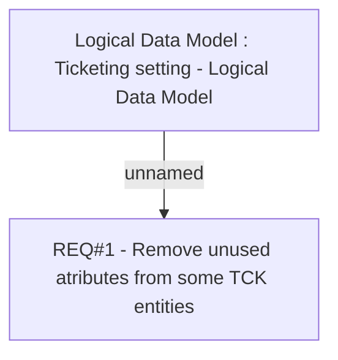

# CBL-1975 (CLM-962) TCK - Remove unused TypeCount attribute from Ticket Type

- **Diagram Type**: Custom
- **Package**: HomerSelect/BSL/Modules/Ticketing (TCK)/Requirements/CBL-1975 (CLM-962) TCK - Remove unused TypeCount attribute from Ticket Type
- **Diagram ID**: 156074
- **Elements**: 2
- **Connectors**: 1

