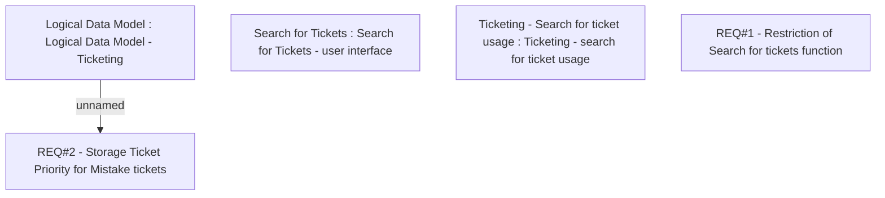

# CBL-2092 (CLM-1017) TCK - Ticket Search Restriction for SA

- **Diagram Type**: Custom
- **Package**: HomerSelect/BSL/Modules/Ticketing (TCK)/Requirements/CBL-2092 (CLM-1017) TCK - Ticket Search Restriction for SA
- **Diagram ID**: 156075
- **Elements**: 5
- **Connectors**: 1

