# CBL-21173 (CLM-5888) New GUI to be created to manage Hosel allocation tool queue in realtime

- **Diagram Type**: Custom
- **Package**: HomerSelect/BSL/Modules/Ticketing (TCK)/Requirements/CBL-21173 (CLM-5888) New GUI to be created to manage Hosel allocation tool queue in realtime
- **Diagram ID**: 157006
- **Elements**: 8
- **Connectors**: 0

```mermaid
graph TD
    n_10_018_Assign_user_into_queue["10.018 Assign user into queue"]
    n_10_019_Unassign_user_from_queue["10.019 Unassign user from queue"]
    unassignUserFromQueue_unassignUserFromQueue["unassignUserFromQueue : unassignUserFromQueue"]
    assignUserIntoQueue_assignUserIntoQueue["assignUserIntoQueue : assignUserIntoQueue"]
    ADD_10_091_User_queue_management["{ADD}10.091 User queue management"]
    ADD_10_092_Queue_detail_screen["{ADD}10.092 Queue detail screen"]
    MOD_Queue_detail_Queue_code["{MOD}Queue detail: ‹Queue code›"]
    CBL_21173_CLM_5888_New_GUI_to_be_created_to_manage_Hosel_all["CBL-21173 (CLM-5888) New GUI to be created to manage Hosel allocation tool queue in realtime"]
```

