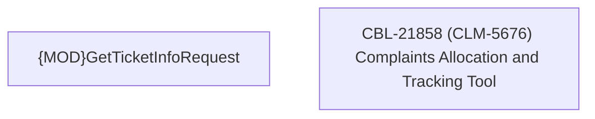

# CBL-21858 (CLM-5676) Complaints Allocation & Tracking Tool

- **Diagram Type**: Custom
- **Package**: HomerSelect/BSL/Modules/Ticketing (TCK)/Requirements/CBL-21858 (CLM-5676) Complaints Allocation & Tracking Tool
- **Diagram ID**: 157000
- **Elements**: 2
- **Connectors**: 0

