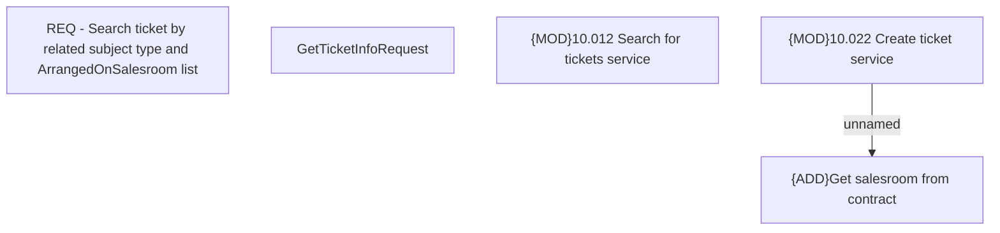

# CBL-29392 (CLM-7205) Ticket search by contract salesroom code

- **Diagram Type**: Custom
- **Package**: HomerSelect/BSL/Modules/Ticketing (TCK)/Requirements/CBL-29392 (CLM-7205) Ticket search by contract salesroom code
- **Diagram ID**: 163040
- **Elements**: 5
- **Connectors**: 1

