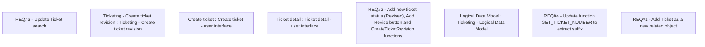

# CBL-3379 (CLM-1558) Edit Ticketing Type & Subtype (Revise ticket)

```mermaid
graph TD
    REQ_3_Update_Ticket_search["REQ#3 - Update Ticket search"]
    Ticketing_Create_ticket_revision_Ticketing_Create_ticket_rev["Ticketing - Create ticket revision : Ticketing - Create ticket revision"]
    Create_ticket_Create_ticket_user_interface["Create ticket : Create ticket - user interface"]
    Ticket_detail_Ticket_detail_user_interface["Ticket detail : Ticket detail - user interface"]
    REQ_2_Add_new_ticket_status_Revised_Add_Revise_button_and_Cr["REQ#2 - Add new ticket status (Revised), Add Revise button and CreateTicketRevision functions"]
    Logical_Data_Model_Ticketing_Logical_Data_Model["Logical Data Model : Ticketing - Logical Data Model"]
    REQ_4_Update_function_GET_TICKET_NUMBER_to_extract_suffix["REQ#4 - Update function GET_TICKET_NUMBER to extract suffix"]
    REQ_1_Add_Ticket_as_a_new_related_object["REQ#1 - Add Ticket as a new related object"]
```
