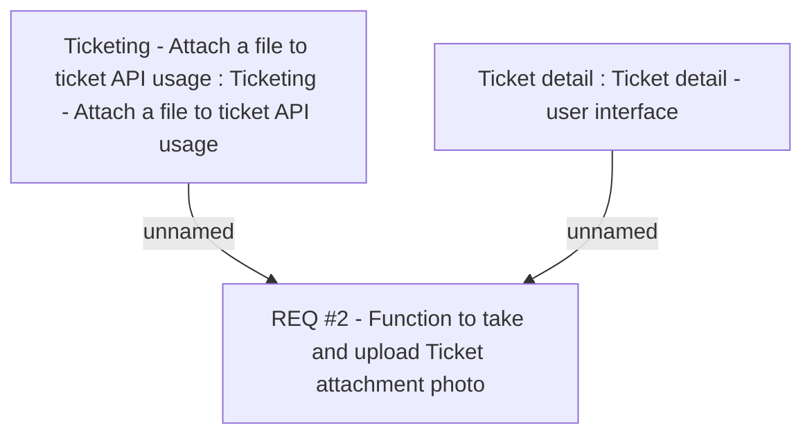

# CBL-3385 (CLM-1323) Function to take and upload Ticket attachment photo

```mermaid
graph TD
    Ticketing_Attach_a_file_to_ticket_API_usage_Ticketing_Attach["Ticketing - Attach a file to ticket API usage : Ticketing - Attach a file to ticket API usage"]
    Ticket_detail_Ticket_detail_user_interface["Ticket detail : Ticket detail - user interface"]
    REQ_2_Function_to_take_and_upload_Ticket_attachment_photo["REQ #2 - Function to take and upload Ticket attachment photo"]
    Ticketing_Attach_a_file_to_ticket_API_usage_Ticketing_Attach -->|unnamed| REQ_2_Function_to_take_and_upload_Ticket_attachment_photo
    Ticket_detail_Ticket_detail_user_interface -->|unnamed| REQ_2_Function_to_take_and_upload_Ticket_attachment_photo
```
