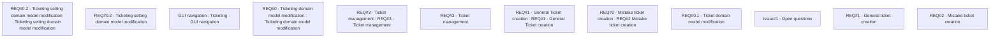

# Ticketing-separation

```mermaid
graph TD
    REQ_0_2_Ticketing_setting_domain_model_modification_Ticketin["REQ#0.2 - Ticketing setting domain model modification : Ticketing setting domain model modification"]
    REQ_0_2_Ticketing_setting_domain_model_modification["REQ#0.2 - Ticketing setting domain model modification"]
    GUI_navigation_Ticketing_GUI_navigation["GUI navigation : Ticketing - GUI navigation"]
    REQ_0_Ticketing_domain_model_modification_Ticketing_domain_m["REQ#0 - Ticketing domain model modification : Ticketing domain model modification"]
    REQ_3_Ticket_management_REQ_3_Ticket_management["REQ#3 - Ticket management : REQ#3 - Ticket management"]
    REQ_3_Ticket_management["REQ#3 - Ticket management"]
    REQ_1_General_Ticket_creation_REQ_1_General_Ticket_creation["REQ#1 - General Ticket creation : REQ#1 - General Ticket creation"]
    REQ_2_Mistake_ticket_creation_REQ_2_Mistake_ticket_creation["REQ#2 - Mistake ticket creation : REQ#2 Mistake ticket creation"]
    REQ_0_1_Ticket_domain_model_modification["REQ#0.1 - Ticket domain model modification"]
    Issue_1_Open_questions["Issue#1 - Open questions"]
    REQ_1_General_ticket_creation["REQ#1 - General ticket creation"]
    REQ_2_Mistake_ticket_creation["REQ#2 - Mistake ticket creation"]
```
