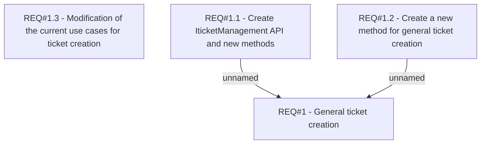

# REQ#1 - General Ticket creation

```mermaid
graph TD
    REQ_1_3_Modification_of_the_current_use_cases_for_ticket_cre["REQ#1.3 - Modification of the current use cases for ticket creation"]
    REQ_1_1_Create_IticketManagement_API_and_new_methods["REQ#1.1 - Create IticketManagement API and new methods"]
    REQ_1_2_Create_a_new_method_for_general_ticket_creation["REQ#1.2 - Create a new method for general ticket creation"]
    REQ_1_General_ticket_creation["REQ#1 - General ticket creation"]
    REQ_1_1_Create_IticketManagement_API_and_new_methods -->|unnamed| REQ_1_General_ticket_creation
    REQ_1_2_Create_a_new_method_for_general_ticket_creation -->|unnamed| REQ_1_General_ticket_creation
```
