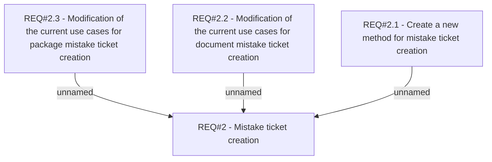

# REQ#2 Mistake ticket creation

```mermaid
graph TD
    REQ_2_3_Modification_of_the_current_use_cases_for_package_mi["REQ#2.3 - Modification of the current use cases for package mistake ticket creation"]
    REQ_2_2_Modification_of_the_current_use_cases_for_document_m["REQ#2.2 - Modification of the current use cases for document mistake ticket creation"]
    REQ_2_1_Create_a_new_method_for_mistake_ticket_creation["REQ#2.1 - Create a new method for mistake ticket creation"]
    REQ_2_Mistake_ticket_creation["REQ#2 - Mistake ticket creation"]
    REQ_2_3_Modification_of_the_current_use_cases_for_package_mi -->|unnamed| REQ_2_Mistake_ticket_creation
    REQ_2_2_Modification_of_the_current_use_cases_for_document_m -->|unnamed| REQ_2_Mistake_ticket_creation
    REQ_2_1_Create_a_new_method_for_mistake_ticket_creation -->|unnamed| REQ_2_Mistake_ticket_creation
```
