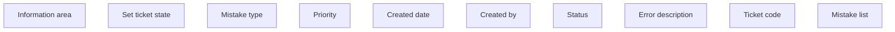

# Mistake list panel (TCK)

- **Diagram Type**: Custom
- **Package**: HomerSelect/BSL/Modules/Ticketing (TCK)/Requirements/CBL-33_Ticketing separation/REQ#6 - Integration with BSL- Contract registration/Changes in user interface model
- **Diagram ID**: 156319
- **Elements**: 10
- **Connectors**: 0

