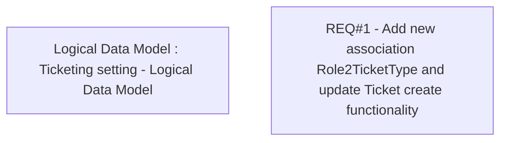

# CBL-5471 (CLM-1959) TCK - Define restricted access for Ticket Type

- **Diagram Type**: Custom
- **Package**: HomerSelect/BSL/Modules/Ticketing (TCK)/Requirements/CBL-5471 (CLM-1959) TCK - Define restricted access for Ticket Type
- **Diagram ID**: 156086
- **Elements**: 2
- **Connectors**: 0

