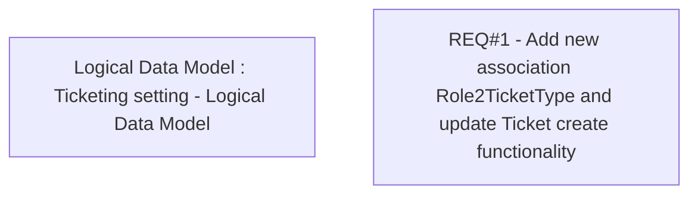

# CBL-5471 (CLM-1959) TCK - Define restricted access for Ticket Type

```mermaid
graph TD
    Logical_Data_Model_Ticketing_setting_Logical_Data_Model["Logical Data Model : Ticketing setting - Logical Data Model"]
    REQ_1_Add_new_association_Role2TicketType_and_update_Ticket_["REQ#1 - Add new association Role2TicketType and update Ticket create functionality"]
```
