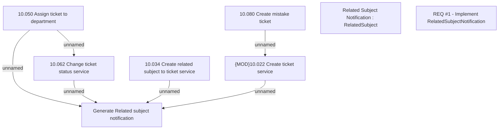

# CBL-6153 (CLM-3712) Registration queue - TCK - Implement Kafka RelatedSubjectNotification

- **Diagram Type**: Custom
- **Package**: HomerSelect/BSL/Modules/Ticketing (TCK)/Requirements/CBL-6153 (CLM-3712) Registration queue - TCK - Implement Kafka RelatedSubjectNotification
- **Diagram ID**: 156088
- **Elements**: 8
- **Connectors**: 6

