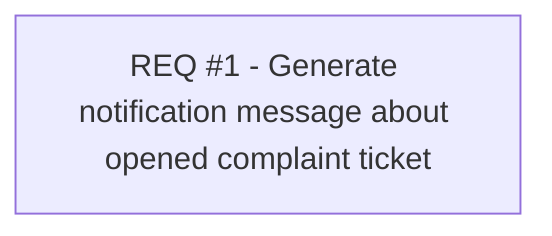

# CBL-6836 (CLM-2184) Use of Complaints number in text message

- **Diagram Type**: Custom
- **Package**: HomerSelect/BSL/Modules/Ticketing (TCK)/Requirements/CBL-6836 (CLM-2184) Use of Complaints number in text message
- **Diagram ID**: 156090
- **Elements**: 1
- **Connectors**: 0

