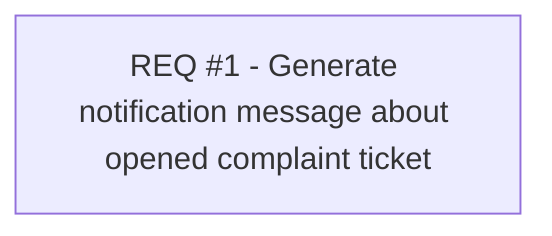

# CBL-6836 (CLM-2184) Use of Complaints number in text message

```mermaid
graph TD
    REQ_1_Generate_notification_message_about_opened_complaint_t["REQ #1 - Generate notification message about opened complaint ticket"]
```
